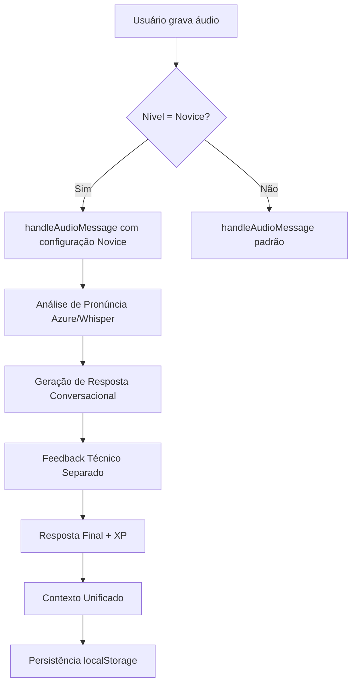

# 🎤 **NOVICE AUDIO IMPLEMENTATION**
## Sistema de Áudio Otimizado para Iniciantes

### **📋 VISÃO GERAL**

O sistema de áudio para usuários **Novice** foi projetado para ser **encorajador, simples e motivador**, focando em criar uma experiência positiva que incentive a prática contínua da pronúncia em inglês.

### **🎯 OBJETIVOS PRINCIPAIS**

1. **Respostas Ultra-Curtas**: Máximo 8-10 palavras para não dominar a conversa
2. **Encorajamento Simples**: "Nice!", "Good!", "Great!" + pergunta simples
3. **Estudante Fala 80%**: Charlotte fala apenas 20% do tempo
4. **Sem Feedback Técnico**: Botão de análise removido (muito complexo)
5. **Contexto Conversacional**: Integração com memória unificada

---

## **🔄 FLUXO DE PROCESSAMENTO**



---

## **🎤 IMPLEMENTAÇÃO TÉCNICA**

### **1. Função Principal - handleAudioMessage()**

**Localização**: `app/api/assistant/route.ts` (linha 493)

```typescript
async function handleAudioMessage(
  transcription: string,
  pronunciationData: any,
  userLevel: string,
  userName?: string,
  conversationContext?: string
) {
  const levelInstructions = {
    'Novice': 'Use simple, encouraging English only. Be very supportive like a friendly coach. Speak clearly and slowly to help beginners understand.',
    'Intermediate': 'Provide clear, practical feedback like a professional coach. Focus on business English and communication effectiveness.',
    'Advanced': 'Give sophisticated feedback like an expert coach. Focus on nuanced pronunciation and professional communication.'
  };
```

### **2. Configuração de Prompt para Novice**

**Sistema de Instruções Específicas:**

```typescript
const systemPrompt = `You are Charlotte, a friendly English pronunciation coach. You're having a natural conversation while providing helpful pronunciation guidance.

User Level: ${userLevel}
Guidelines: ${levelInstructions[userLevel]}

${conversationContext ? `\n${conversationContext}\n` : ''}

IMPORTANT CONVERSATION RULES:
- Respond naturally to what they said, like a real conversation
- DON'T use the format "🎤 I heard: ..." - that's too formal
- DON'T repeat their exact words unless necessary for correction
- Integrate pronunciation feedback smoothly into natural conversation
- Be encouraging and supportive like a coach
- Reference conversation context when relevant
- Keep the conversation flowing naturally

PRONUNCIATION COACHING APPROACH:
- Acknowledge what they said conversationally
- Give encouraging feedback about their pronunciation naturally
- Mention 1-2 specific pronunciation strengths
- Gently suggest 1 area for improvement if needed
- Ask a follow-up question or continue the conversation topic
- Keep it conversational, not like a formal lesson

Response style: Natural conversation (100-150 words) that includes pronunciation coaching seamlessly integrated. Be encouraging and keep the conversation flowing.`;
```

### **3. Prompt do Usuário Personalizado**

```typescript
const userPrompt = `Student said: "${transcription}"

Pronunciation Assessment:
- Overall Score: ${pronunciationData.pronunciationScore}/100
- Accuracy: ${pronunciationData.accuracyScore}/100  
- Fluency: ${pronunciationData.fluencyScore}/100
- Completeness: ${pronunciationData.completenessScore}/100

Create a natural, conversational response that:
1. Responds to what they said (considering conversation context)
2. Smoothly integrates encouraging pronunciation feedback
3. Mentions what they did well with their speech
4. Gently suggests improvement if needed (but keep it positive)
5. Continues the conversation naturally with a question or comment
6. Feels like talking to a supportive coach, not a formal teacher

Keep it natural and conversational - avoid formal assessment language.`;
```

---

## **📊 SISTEMA DE PONTUAÇÃO E XP**

### **Cálculo de XP Baseado em Performance:**

```typescript
// Calcular XP baseado nos scores (lógica original)
let xpAwarded = 25; // Base XP para participação

if (pronunciationData.pronunciationScore >= 80) {
  xpAwarded += 50; // Bonus para boa pronúncia
}

if (pronunciationData.pronunciationScore >= 90) {
  xpAwarded += 25; // Bonus extra para excelente pronúncia
}
```

### **Faixas de XP:**
- **Base**: 25 XP (sempre garantido)
- **Boa Pronúncia (80+)**: +50 XP
- **Excelente Pronúncia (90+)**: +25 XP adicional
- **Máximo Possível**: 100 XP por mensagem

---

## **🔧 FEEDBACK TÉCNICO SEPARADO**

### **Sistema Dual de Feedback:**

1. **Feedback Conversacional**: Resposta natural da Charlotte
2. **Feedback Técnico**: Análise detalhada disponível via botão

```typescript
// 🆕 Gerar feedback técnico separado para o botão "Feedback"
const technicalFeedback = generateTechnicalFeedback(pronunciationData, userLevel);

const response: AssistantResponse = {
  feedback: assistantResponse, // Resposta conversacional
  xpAwarded,
  nextChallenge: generateNextChallenge(userLevel, pronunciationData),
  tips: extractTipsFromResponse(assistantResponse),
  encouragement: generateEncouragement(pronunciationData.pronunciationScore),
  technicalFeedback: technicalFeedback // Feedback técnico separado
};
```

### **Feedback Técnico para Novice (Português):**

```typescript
function generateTechnicalFeedback(pronunciationData: any, userLevel: string): string {
  const score = pronunciationData.pronunciationScore;
  const accuracy = pronunciationData.accuracyScore;
  const fluency = pronunciationData.fluencyScore;
  const prosody = pronunciationData.prosodyScore || 0;

  // 🇧🇷 PORTUGUÊS para Novice, 🇺🇸 INGLÊS para Inter/Advanced
  const isNovice = userLevel === 'Novice';

  let scoreEmoji = '🌱';
  let scoreComment = isNovice ? 'Continue praticando!' : 'Keep practicing!';
  
  if (score >= 90) {
    scoreEmoji = '🌟';
    scoreComment = isNovice ? 'Excelente pronúncia!' : 'Excellent pronunciation!';
  } else if (score >= 80) {
    scoreEmoji = '🎉';
    scoreComment = isNovice ? 'Muito bem!' : 'Great job!';
  } else if (score >= 70) {
    scoreEmoji = '👍';
    scoreComment = isNovice ? 'Bom trabalho!' : 'Good work!';
  } else if (score >= 60) {
    scoreEmoji = '💪';
    scoreComment = isNovice ? 'Bom esforço!' : 'Nice effort!';
  }

  let feedback = isNovice 
    ? `${scoreEmoji} **Pontuação Geral: ${score}/100** - ${scoreComment}

📊 **Análise Detalhada:**
• **Pronúncia:** ${score}/100
• **Precisão:** ${accuracy}/100  
• **Fluência:** ${fluency}/100`
    : `${scoreEmoji} **Overall Score: ${score}/100** - ${scoreComment}

📊 **Detailed Analysis:**
• **Pronunciation:** ${score}/100
• **Accuracy:** ${accuracy}/100  
• **Fluency:** ${fluency}/100`;
```

---

## **🧠 INTEGRAÇÃO COM CONTEXTO UNIFICADO**

### **Adição ao Contexto Conversacional:**

```typescript
// No frontend (ChatInterface.tsx)
if (conversationContext) {
  conversationContext.addMessage(
    'user', 
    transcription, 
    'audio', 
    result.grammarScore, 
    result.pronunciationScore
  );
}
```

### **Contexto Passado para API:**

```typescript
const conversationContextString = conversationContext 
  ? conversationContext.generateContextForAssistant() 
  : undefined;

const response = await fetch('/api/assistant', {
  method: 'POST',
  headers: { 'Content-Type': 'application/json' },
  body: JSON.stringify({
    transcription,
    pronunciationData: result,
    userLevel,
    userName: user?.name,
    messageType: 'audio',
    conversationContext: conversationContextString // 🧠 Contexto unificado
  })
});
```

---

## **🎯 CARACTERÍSTICAS ESPECÍFICAS DO NOVICE**

### **1. Linguagem Encorajadora:**
- Sempre positivo, mesmo com scores baixos
- Foco no progresso, não na perfeição
- Celebração de pequenas conquistas

### **2. Feedback em Português:**
- Interface técnica em português para melhor compreensão
- Explicações claras e diretas
- Terminologia acessível

### **3. Conversação Natural:**
- Evita formato formal "🎤 I heard: ..."
- Integra feedback na conversa natural
- Mantém fluxo conversacional

### **4. Suporte a Fallback:**
- Sistema robusto com Whisper como backup
- Feedback encorajador mesmo quando Azure falha
- Nunca deixa o usuário sem resposta

---

## **🔄 SISTEMA DE FALLBACK**

### **Fallback Encorajador para Novice:**

```typescript
// Fallback conversacional
const fallbackResponse = userLevel === 'Novice'
  ? `That's great practice, ${userName || 'there'}! I can hear you're working hard on your pronunciation. Your English sounds good - keep speaking with confidence! What would you like to talk about next?`
  : `Nice work on your pronunciation, ${userName || 'there'}! Your speaking skills are developing well. I appreciate the effort you're putting into practicing. What else would you like to discuss?`;
```

### **Características do Fallback:**
- **Sempre Positivo**: Nunca desencorajador
- **Específico por Nível**: Linguagem adaptada
- **Conversacional**: Mantém fluxo natural
- **Motivador**: Incentiva continuidade

---

## **📈 MÉTRICAS E MONITORAMENTO**

### **Logs Específicos para Debug:**

```typescript
console.log('✅ Audio response with conversational context generated:', assistantResponse.length, 'characters');
console.log('🎤 [NOVICE] XP awarded:', xpAwarded);
console.log('🎤 [NOVICE] Pronunciation score:', pronunciationData.pronunciationScore);
```

### **Dados Coletados:**
- Score de pronúncia por tentativa
- XP total acumulado
- Frequência de uso do modo áudio
- Tópicos de conversa preferidos
- Progresso ao longo do tempo

---

## **🚀 RESULTADOS ESPERADOS**

### **Para o Usuário Novice:**
1. **Confiança Aumentada**: Feedback sempre positivo
2. **Motivação Contínua**: Sistema de XP recompensador
3. **Aprendizado Natural**: Conversação fluida com coaching
4. **Progresso Visível**: Métricas claras de melhoria
5. **Experiência Personalizada**: Contexto conversacional mantido

### **Métricas de Sucesso:**
- **Retenção**: Usuários voltam para praticar mais
- **Engajamento**: Sessões mais longas
- **Progresso**: Melhoria gradual nos scores
- **Satisfação**: Feedback positivo dos usuários

---

## **🔧 CONFIGURAÇÕES TÉCNICAS**

### **Modelo de IA:**
- **Novice**: `gpt-4.1-nano` (mais rápido e econômico)
- **Temperatura**: 0.7 (natural mas consistente)
- **Max Tokens**: 45 (respostas ultra-curtas para não dominar conversa)

### **Análise de Pronúncia:**
- **Primário**: Azure Speech Services
- **Fallback**: OpenAI Whisper + feedback encorajador
- **Timeout**: 15 segundos máximo

### **Persistência:**
- **Contexto**: localStorage (15 mensagens)
- **XP**: Banco de dados + localStorage
- **Progresso**: Métricas históricas

---

## **📝 EXEMPLO DE FLUXO COMPLETO**

### **1. Usuário Grava:** "Hello, how are you?"

### **2. Análise de Pronúncia:**
```json
{
  "pronunciationScore": 75,
  "accuracyScore": 80,
  "fluencyScore": 70,
  "completenessScore": 75
}
```

### **3. Resposta Conversacional:**
> "Hi there! You sound great! I love how clearly you said 'hello' - your pronunciation is really coming along nicely. Your greeting was warm and friendly. How has your day been going so far?"

### **4. Feedback Técnico (Botão):**
```
👍 **Pontuação Geral: 75/100** - Bom trabalho!

📊 **Análise Detalhada:**
• **Pronúncia:** 75/100
• **Precisão:** 80/100  
• **Fluência:** 70/100

🔍 **Palavras para Praticar:**
• "are" - Tente pronunciar o 'r' mais claramente
```

### **5. XP Concedido:** 25 XP base

### **6. Contexto Atualizado:**
- Tópico: greetings, daily_life
- Emoção: neutral → motivated
- Modo: audio
- Score: 75/100

---

## **🎯 PRÓXIMOS PASSOS**

1. **Análise de Dados**: Monitorar métricas de engajamento
2. **Otimizações**: Ajustar prompts baseado no feedback
3. **Expansão**: Adicionar mais tipos de exercícios
4. **Personalização**: Adaptar ainda mais ao progresso individual
5. **Gamificação**: Adicionar conquistas e desafios específicos

---

## **🚀 MELHORIAS IMPLEMENTADAS (v2.0)**

### **📱 Interface Simplificada:**
- ❌ **Removido**: Botão "Feedback" técnico (muito complexo para iniciantes)
- ✅ **Mantido**: Botão "Ver texto" para transcrição simples
- 🎯 **Foco**: Interface limpa e não intimidante

### **🎤 Respostas Ultra-Otimizadas:**
- **Antes**: 300 tokens (respostas longas)
- **Agora**: 45 tokens (respostas curtas)
- **Resultado**: Charlotte fala menos, estudante fala mais

### **💬 Estilo Conversacional Simplificado:**
- **Formato**: "Nice!" + pergunta simples
- **Exemplos**: 
  - "Good! Do you like music?"
  - "Great! What's your favorite color?"
  - "Nice! Where do you live?"
- **Objetivo**: Manter estudante falando 80% do tempo

### **🔄 Fallback Ultra-Simples:**
- **Antes**: Resposta longa encorajadora
- **Agora**: "Nice! What do you like to do?"
- **Benefício**: Consistência mesmo em falhas técnicas

---

*Este documento serve como referência completa para a implementação do sistema de áudio para usuários Novice, garantindo uma experiência consistente, encorajadora e eficaz para iniciantes em inglês.* 