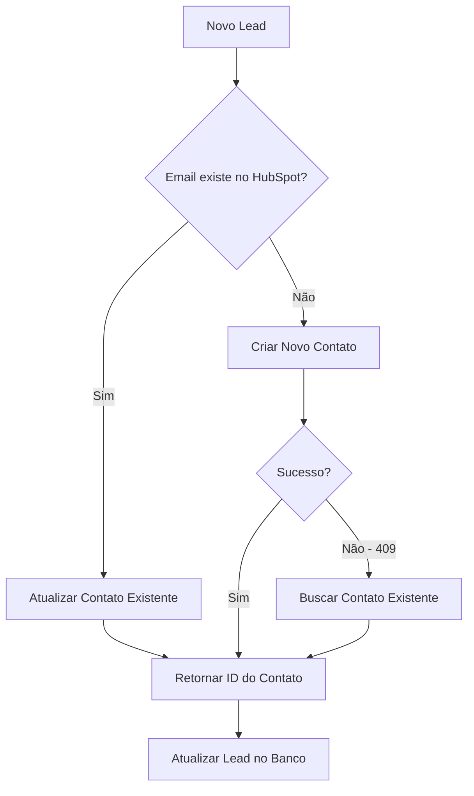

# Prevenção de Duplicidade no HubSpot

Este documento explica como o sistema previne a criação de contatos duplicados no HubSpot.

## 🔍 Como Funciona

### 1. **Verificação Prévia**
- Antes de criar um novo contato, o sistema busca por contatos existentes com o mesmo email
- Utiliza o método `findContactByEmail()` para realizar a busca

### 2. **Estratégia de Atualização**
- **Se contato existe**: Atualiza as informações do contato existente
- **Se contato não existe**: Cria um novo contato
- **Se erro 409 (conflito)**: Busca o contato existente e retorna

### 3. **Campos Atualizados**
Quando um contato já existe, os seguintes campos são atualizados:
- `firstname` e `lastname`
- `phone` (telefone)
- `hs_lead_status: 'NEW'`
- `origem: 'Charlotte 7 dias'`
- `hubspot_owner_id` (se configurado)

## 🛡️ Proteções Implementadas

### **Nível 1: Verificação de Email**
```typescript
const existingContact = await this.findContactByEmail(contactData.email);
```

### **Nível 2: Tratamento de Conflito**
```typescript
if (response.status === 409) {
  // Contato já existe, buscar e retornar
  const existingContact = await this.findContactByEmail(contactData.email);
}
```

### **Nível 3: Banco de Dados**
- Verificação de email duplicado na tabela `leads`
- Prevenção de múltiplos cadastros do mesmo usuário

## 📊 Fluxo de Dados



## ✅ Benefícios

1. **Sem Duplicatas**: Garante que cada email tenha apenas um contato no HubSpot
2. **Dados Atualizados**: Informações sempre atualizadas com os dados mais recentes
3. **Proprietário Consistente**: Todos os contatos são atribuídos ao proprietário correto
4. **Performance**: Evita criação desnecessária de contatos duplicados

## 🧪 Teste de Funcionamento

Para testar a prevenção de duplicidade:

```bash
# Primeira criação
curl -X POST "http://localhost:3000/api/leads" \
  -H "Content-Type: application/json" \
  -d '{"nome": "Teste", "email": "teste@exemplo.com", "telefone": "(11) 99999-9999", "nivel": "Advanced"}'

# Segunda criação (deve atualizar)
curl -X POST "http://localhost:3000/api/leads" \
  -H "Content-Type: application/json" \
  -d '{"nome": "Teste Atualizado", "email": "teste@exemplo.com", "telefone": "(11) 88888-8888", "nivel": "Inter"}'
```

## 📝 Logs

O sistema registra as seguintes ações:
- `📧 Contato já existe no HubSpot, atualizando: {id}`
- `✅ Contato atualizado no HubSpot: {id}`
- `✅ Contato criado no HubSpot: {id}`
- `⚠️ Conflito: contato já existe, buscando...`

## 🔧 Configuração

A prevenção de duplicidade é automática quando:
- `HUBSPOT_API_KEY` está configurado
- `HUBSPOT_DEFAULT_OWNER_ID` está configurado (opcional)

Não requer configuração adicional.
